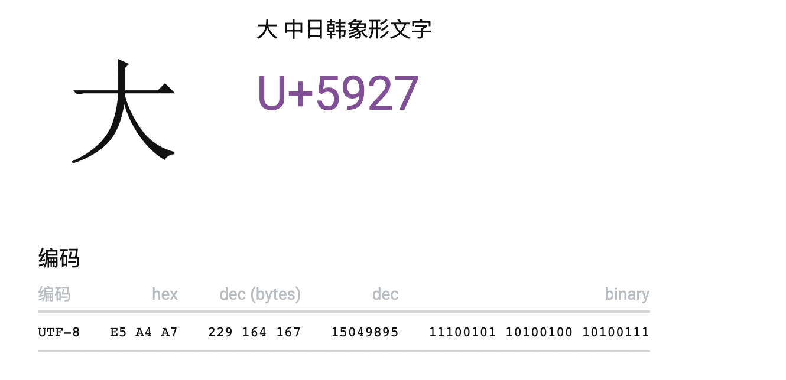

MySQL 数据库中的 utf8 和 utf8mb4 都的的确确是UTF-8编码，这是毋庸置疑的！

网上说 utf8 不是真正的 UTF-8 也并不是很准确。

它们两者唯一的区别在于 utf8 最大只支持 3 字节容量的字符，而 utf8mb4 即 utf8 most bytes 4 可以支持 4 字节。

**那么究竟是哪些字符 utf8 存储不了？**

带着这个疑问，先来看下UTF8编码的规则：

| 字节数 | 二进制                              |
| ------ | ----------------------------------- |
| 1字节  | 0xxxxxxx                            |
| 2字节  | 110xxxxx 10xxxxxx                   |
| 3字节  | 1110xxxx 10xxxxxx 10xxxxxx          |
| 4字节  | 11110xxx 10xxxxxx 10xxxxxx 10xxxxxx |

搞懂 UTF-8 编码规则，只需要搞懂一个问题，**当我知道一个字符的 Unicode 编号，那么我如何反推它的 UTF-8 编码？**



比如“大”字的 Unicode 编号是 5927，转换为 2 进制是 101 100100 100111，共15位，上表中刚好满足的是 3 字节那行，它的 xxxx 有16个。

咱们按照从后向前的顺序放入，放完后是 1110x101 10100100 10100111，咱们再把剩余的 x 替换为 0，得到的最终 UTF-8 编码的“大”字符的二进制为：11100101 10100100 10100111，对照上图，答案一致。

到此，我们可以推断出 3 字节的 UTF-8 编码支持的最大编号的 Unicode 字符是：

11101111 10111111 10111111（十六进制表示是 0XFFFF）

即将 3 字节那行的 xxxx 全部替换为1。

这也是 MySQL 数据库 utf8 编码能支持的最大编号的 Unicode 字符。

**不止是 emoji，所有超过 0XFFFF 编号的 Unicode 字符，utf8 统统支持不了！**

回到本文标题的问题，如何让 3 字节的 utf8 支持 4 字节的 emoji？

答案呼之欲出，只需要将超过 0XFFFF 编号的 Unicode 字符进行编码与解码。

下面贴出 Java 实现的工具类，可以直接复制使用。

```java
import java.util.regex.Matcher;
import java.util.regex.Pattern;


public class EmojiUtils {

    /**
     * 将带有emoji表情的字符串转码。
     * 格式 &#{code}; code 是 表情 Unicode 码的 十进制
     */
    public static String emojiEncode(String source) {
        if (source == null || source.isEmpty()) {
            return source;
        }
        int length = source.length();
        // 返回此字符串指定文本范围内的 Unicode 码点数，即 Unicode字符数
        int codePointCount = source.codePointCount(0, source.length());
        /*
           Java 语言中 char 字符是16位，转十六进制即 FFFF，也就是一个char最大存储的 Unicode 字符编号为 FFFF，
           这与 MySQL中 utf8 最大只支持3字节即最大支持 Unicode字符编号 FFFF 不谋而合！
           如果出现编号大于 FFFF 的 Unicode字符，那么Unicode字符数与实际的 char数组大小必定不相等！
         */
        if (length == codePointCount) {
            return source;
        }
        // Unicode 字符 转 编号
        int[] codePointsArray = source.codePoints().toArray();
        StringBuilder stringBuilder = new StringBuilder();
        for (int codePoint : codePointsArray) {
            if (codePoint <= 0XFFFF) {
                stringBuilder.append((char) codePoint);
            } else {
                // 放不下的Unicode字符转编号存储
                stringBuilder.append("&#").append(codePoint).append(";");
            }
        }
        return stringBuilder.toString();
    }

    /**
     * 将带有 &#{code}; 格式的字符串，解码到原始字符串。
     */
    public static String emojiDecode(String source) {
        if (source == null || source.isEmpty()) {
            return source;
        }
        StringBuffer stringBuffer = new StringBuffer();

        String regex = "&#(\\d+);";
        Pattern pattern = Pattern.compile(regex);
        Matcher matcher = pattern.matcher(source);

        while (matcher.find()) {
            // 匹配到的文本，即 &#000;
            String group = matcher.group();
            // 提取 Unicode 编号
            String substring = group.substring(2, group.length() - 1);
            // 强制转 字符
            String s = new String(Character.toChars(Integer.parseInt(substring)));
            // 替换匹配的字符
            matcher.appendReplacement(stringBuffer, s);
        }
        matcher.appendTail(stringBuffer);

        return stringBuffer.toString();
    }

    public static void main(String[] args) {
        String emojiEncode = emojiEncode("你叉叉、穷哈哈，😀，Sorry~");
        System.out.println(emojiEncode);
        System.out.println(emojiDecode(emojiEncode));
    }
}
```


