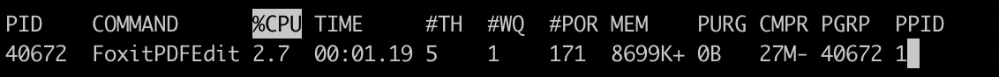

我叫王大锤，是一名程序员。

今天我正在敲代码的时候，电脑突然卡了？？

WHAT！这可是 Mac M1 芯片，号称要将英特尔按在地上摩擦的处理器，怎么会卡？

身为一个具备职业素养的程序员，第一反应就是打开终端执行`top`命令，看看是哪个小玩意在和我在开玩笑。

终于，让我逮着了这么一个不可能出现的进程：


通过 PDFEdit 让我顾名思义想到这是一个 PDF 编辑器，可我电脑上没装什么 PDF 软件啊？

当我复制这个进程名百度了一下，原来是它....


这让我想起那天夕阳下的奔跑，那是我逝去的青春....


跑题了…… 没戳，是有那么一天，我下载了这个软件，用完就卸载了，没想到它对我竟然那么恋恋不舍。

好吧，我把它 kill 了总行了吧。

拜拜~~

 ```shell
 sudo kill -9 66335
 ```

万万没想到，它又复活了。



你以为你换了个 ID 我就不认识你了 😤

下面就是我名侦探王大锤揭晓谜底的时刻了！（BGM 请自行脑补）

首先，这台电脑已经经过了我数次重启，进程依然还在，那只能是开机自启动导致。

macOS 开机启动一般使用 launchctl 加载 plist 文件，位置在以下几个目录：

- `~/Library/LaunchAgents` 由用户自己定义的任务项
- `/Library/LaunchAgents` 由管理员为用户定义的任务项
- `/Library/LaunchDaemons` 由管理员定义的守护进程任务项
- `/System/Library/LaunchAgents` 由Mac OS X为用户定义的任务项
- `/System/Library/LaunchDaemons` 由Mac OS X定义的守护进程任务项

只需要按个目录逐个排查下，就可以找到让其死而复生的方法！

```shell
/Library/LaunchDaemons » ls
com.foxit.PDFEditorUpdateService.plist
```

通过 `cat` 命令查看这个 plist 文件，找到可执行程序的文件路径：

```
/Library/Application Support/Foxit Software/FoxitService/FoxitPDFEditorUpdateService.app/Contents/MacOS/FoxitPDFEditorUpdateService
```

然后把整个目录删掉：

```shell
rm -rf /Library/Application\ Support/Foxit\ Software/
```

最后，再尝试把这个进程 `kill` 掉……

一阵硝烟弥漫~

万万没想到，我终究还是杀死了这个流氓进程！


> 参考：[Mac设置开机启动 - 简书 (jianshu.com)](https://www.jianshu.com/p/49dabd8ec9bb)