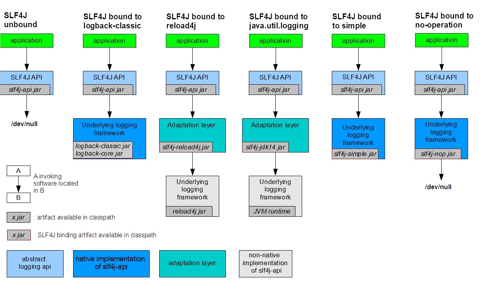

# SLF4J入门

Simple Logging Facade for Java (SLF4J) 可用作各种日志记录框架（如 java.util.logging、logback 和 reload4j）的简单外观或抽象。SLF4J 必需的依赖库只有一个 slf4j-api.jar。

SLF4J 支持各种日志记录框架，比如使用 Logback 时，还需要添加 logback-core.jar 以及 logback-classic.jar。

借用官网的一张图说明下依赖关系：



# Logback初始化

通过一个例子看下 Logback 的初始化过程：

```java
import org.slf4j.Logger;
import org.slf4j.LoggerFactory;
import ch.qos.logback.classic.LoggerContext;

public class LogTest {
    public static void main(String[] args) {
        // 获取 LoggerContext，包含全部 Logger、Appender 等，可以通过编程的方式动态更新
        LoggerContext loggerContext = (LoggerContext) LoggerFactory.getILoggerFactory();
        // 打印内部的状态
        StatusPrinter.print(loggerContext);

        // 获取所有的 Logger
        List<ch.qos.logback.classic.Logger> loggerList = loggerContext.getLoggerList();
        for (ch.qos.logback.classic.Logger logger : loggerList) {
            // 获取 Logger 下绑定的 Appender
            Iterator<Appender<ILoggingEvent>> appenderIterator = logger.iteratorForAppenders();
        }

        // 打印 LoggerContext 信息及环境变量
        System.out.println(loggerContext.getName());
        System.out.println(loggerContext.getProperty("HOSTNAME"));

        // 通过编码的方式加载指定的配置文件
        JoranConfigurator joranConfigurator = new JoranConfigurator();
        joranConfigurator.setContext(loggerContext);
        loggerContext.reset();
        try {
            joranConfigurator.doConfigure("src/main/resources/logback-demo.xml");
        } catch (JoranException e) {
            e.printStackTrace();
        }
        // 打印上下文状态的内容，但仅当它们包含警告或错误时。
        StatusPrinter.printInCaseOfErrorsOrWarnings(loggerContext);

        Logger logger = LoggerFactory.getLogger("com.foo");
        logger.info("Hello world");

        // 停止 Logback
        loggerContext.stop();
    }
}
```

控制台前几行输出：

```log
16:45:50,929 |-INFO in ch.qos.logback.classic.LoggerContext[default] - Could NOT find resource [logback-test.xml]
16:45:50,929 |-INFO in ch.qos.logback.classic.LoggerContext[default] - Could NOT find resource [logback.groovy]
16:45:50,929 |-INFO in ch.qos.logback.classic.LoggerContext[default] - Could NOT find resource [logback.xml]
16:45:50,933 |-INFO in ch.qos.logback.classic.BasicConfigurator@2db0f6b2 - Setting up default configuration.
```

以下是 logback 的初始化步骤：

1. logback 会在类路径下寻找名为 logback-test.xml 的文件。
2. 如果没有找到，logback 会继续寻找名为 logback.groovy 的文件。
3. 如果没有找到，logback 会继续寻找名为 logback.xml 的文件。
4. 如果没有找到，将会通过 JDK 提供的 [ServiceLoader](https://docs.oracle.com/javase/6/docs/api/java/util/ServiceLoader.html) 工具在类路径下寻找文件 *META-INFO/services/ch.qos.logback.classic.spi.Configurator*，该文件的内容为实现了 [`Configurator`](https://logback.qos.ch/xref/ch/qos/logback/classic/spi/Configurator.html) 接口的实现类的全限定类名。
5. 如果以上都没有成功，logback 会通过 [BasicConfigurator](https://logback.qos.ch/xref/ch/qos/logback/classic/BasicConfigurator.html) 为自己进行配置，并且日志将会全部在控制台打印出来。

最后一步的目的是为了保证在所有的配置文件都没有被找到的情况下，提供一个默认的（但是是非常基础的）配置。

# Logback配置

可以通过编程或者配置 XML 脚本或者 Groovy 格式的方式来配置 logback。

```xml
<?xml version="1.0" encoding="UTF-8"?>

<!-- debug：是否将状态信息打印到控制台 -->
<!-- scan：当配置文件更改时，自动加载。默认情况下，一分钟扫描一次配置文件 -->
<!-- scanPeriod：指定扫描周期，扫描周期的时间单位可以是毫秒、秒、分钟或者小时，如果没有指定时间单位，则默认为毫秒 -->
<!-- packagingData：是否展示包数据，开启后 logback 会在堆栈的每一行显示 jar 包的名字以及 jar 的版本号。可以解决 jar 版本冲突，代价较高，默认禁用 -->
<configuration debug="true" scan="true" scanPeriod="30 seconds" packagingData="true">
    <!-- OnConsoleStatusListener：完全等同于设置 debug="true"，二选一即可  -->
    <statusListener class="ch.qos.logback.core.status.OnConsoleStatusListener"/>

    <!-- contextName：设置 logger context 的名字，默认 default -->
    <contextName>myAppName</contextName>

    <!-- property：定义变量。也可以不写，不写的话一是在 java 的系统变量中定义一个同样的变量名；二是使用时带默认值 ${K:-V} -->
    <property name="ENCODER_PATTERN" value="%d{yyyy-MM-dd HH:mm:ss.SSS} %-5level %logger{50}: %msg%n"/>

    <!-- scope：指定该变量的作用域，可选择为：local，context，system，意思是本地、上下文、系统，默认 local -->
    <property scope="context" name="nodeId" value="firstNode"/>

    <!-- file: 将变量放到一个配置文件中，然后引用外部文件 -->
    <property file="F:\project\logback-examples\src\main\resources\variables1.properties"/>

    <!-- resource：引用 classpath 下的资源文件 -->
    <property resource="resource1.properties"/>

    <!-- define：动态定义属性，使用方法 ${name} -->
    <!-- class：引用实现了 PropertyDefiner 接口的类。PropertyDefiner 实例的 getPropertyValue() 的返回值就是变量的值 -->
    <define name="rootLevel" class="ch.qos.logback.core.property.FileExistsPropertyDefiner">
        <!-- 只要在实现类里面，各属性有对应的 set 方法，logback 就可以通过配置文件给各属性注入对应的值 -->
        <path>F:\project\logback-examples\src\main\resources\variables1.properties</path>
        <!-- logback 已经有了几个默认的实现类 FileExistsPropertyDefiner、ResourceExistsPropertyDefiner -->
    </define>

    <!--  if..then..else：条件标签。需要将 Janino 库添加到 classpath。可以用来区分线下和线上环境。  -->
    <if condition='property("HOSTNAME").contains("volong")'>
        <then>
        </then>
        <else>
        </else>
    </if>

    <!-- include：引入外部的配置文件。optional：设置该配置文件是可选的 -->
    <include file="src/main/resources/includedConfig.xml" optional="true"/>
    <include resource="includedConfig.xml"/>
    <include url="http://some.host.com/includedConfig.xml"/>

    <!-- timestamp：时间戳标签。可以用于文件唯一命名。  -->
    <!-- datePattern：日期格式必须遵循 SimpleDateFormat 中的规范 -->
    <!-- timeReference：默认为解析配置文件的时间，也就是当前时间。可以设置为上下文初始化的时间：contextBirth  -->
    <timestamp key="bySecond" datePattern="yyyyMMdd'T'HHmmss" timeReference="contextBirth"/>

    <!-- appender：该标签的含义是将日志事件进行输出，例如输出到控制台、本地文件、远程服务器、邮件、数据库等 -->
    <!-- name：指定 appender 的名字 -->
    <!-- class：指定类的全限定名用于实例化，必须实现 ch.qos.logback.core.Appender 接口 -->

    <!-- ConsoleAppender：输出到控制台 -->
    <appender name="consoleAppender" class="ch.qos.logback.core.ConsoleAppender">
        <!-- withJansi：设置 withJansi 为 true 可以激活 Jansi 在 windows 使用 ANSI 彩色代码  -->
        <withJansi>true</withJansi>
        <!-- encoder：默认使用 ch.qos.logback.classic.encoder.PatternLayoutEncoder，将日志事件转换为字节数组，同时将字节数组写入到一个 OutputStream 中 -->
        <encoder>
            <!-- layout：负责将日志事件转换为字符串。默认的 PatternLayoutEncoder 内部绑定了默认的 PatternLayout，故不需要再声明 -->

            <!-- pattern：输出日志格式，%d表示日期，%thread表示线程名，%-5level：级别从左显示5个字符宽度%msg：日志消息，%n是换行符，%logger{50} logger的名称及显示的最大长度。
             着色：PatternLayout 可以识别 "%black"，"%red"，"%green"，"%yellow"，"%blue"，"%magenta","%cyan", "%white", "%gray","%boldRed",
                "%boldGreen", "%boldYellow", "%boldBlue", "%boldMagenta""%boldCyan", "%boldWhite" 以及 "%highlight" 作为转换字符。任何被颜色转换字符包裹的子模式都会通过指定的颜色输出。
             分组：圆括号被看作为分组标记。因此，它能够对子模式进行分组，并且直接对子模式进行格式化。例如：%-30(%d{HH:mm:ss.SSS} [%thread]) 会在少于 30 个字符时进行右填充。
             MDC：用法 %X{MDC_KEY}，通过调用 MDC 类的静态方法将变量写入到线程上下文中，并在日志中输出。可以给每个请求打上唯一的标记。
             -->
            <pattern>%d{yyyy-MM-dd HH:mm:ss.SSS} %thread %X{MDC_NAME} %red(%-5level) %logger{50}: %msg%n</pattern>
            <!-- charset：编码方式 -->
            <charset>UTF-8</charset>
            <!-- outputPatternAsHeader：logback 可以将设置的 pattern 插入到日志文件的顶部。默认关闭 -->
            <outputPatternAsHeader>true</outputPatternAsHeader>
        </encoder>
    </appender>

    <!-- FileAppender：将日志事件输出到文件中 -->
    <appender name="fileAppender" class="ch.qos.logback.core.FileAppender">
        <!-- file：要写入文件的名称。如果文件不存在，则新建。
         在 windows 平台上，用户经常忘记对反斜杠进行转义。例如，c:\temp\test.log 不会被正确解析，因为 '\t' 是一个转义字符，会被解析为一个 tab 字符 (\u0009)。
         正确的值应该像：c:/temp/test.log 或者 c:\\temp\\test.log。没有默认值。 -->
        <file>log/file-${bySecond}.log</file>
        <!-- append：如果为 true，日志事件会被追加到文件中，否则的话，文件会被截断。默认为 true -->
        <append>true</append>
        <!-- prudent：严格模式，默认关闭。严格模式依赖排他文件锁，会对性能有明显的影响，应该避免使用严格模式。严格模式会使 append 属性被自动设置为 true -->
        <prudent>false</prudent>
        <!-- immediateFlush：立即刷新，将 immediateFlush 设置为 false 可以获得更高的日志吞吐量，默认 true -->
        <immediateFlush>true</immediateFlush>
        <encoder>
            <pattern>${ENCODER_PATTERN}</pattern>
        </encoder>
    </appender>

    <!-- RollingFileAppender：继承自FileAppender，具有轮转日志文件的功能。在满足了特定的条件之后，将日志输出到另外一个文件。
        为了让 RollingFileAppender 生效，必须同时设置 RollingPolicy 与 TriggeringPolicy。
        但是，如果 RollingPolicy 也实现了 TriggeringPolicy 接口，那么只需要设置前一个就好了 -->
    <!-- rollingPolicy：负责日志轮转的功能，负责发生什么。轮转的方式为：移动文件以及对文件改名 -->
    <!-- triggeringPolicy：负责日志轮转的时机，负责什么时候发生。 -->
    <appender name="rollingFileAppender" class="ch.qos.logback.core.rolling.RollingFileAppender">
        <file>log/rollingFile.log</file>
        <append>true</append>
        <encoder>
            <pattern>${ENCODER_PATTERN}</pattern>
            <charset>UTF-8</charset>
        </encoder>
        <!-- TimeBasedRollingPolicy：最常用的轮转策略。它是基于时间来定义轮转策略。例如按天或者按月。
         TimeBasedRollingPolicy 既负责轮转的行为，也负责触发轮转。TimeBasedRollingPolicy 支持文件自动压缩，如果 fileNamePattern 以 .gz 或者 .zip 结尾，将会启动这个特性。-->
        <rollingPolicy class="ch.qos.logback.core.rolling.TimeBasedRollingPolicy">
            <!-- fileNamePattern：该属性定义了轮转时的属性名。它的值应该由文件名加上一个 %d 的占位符。%d 应该包含  java.text.SimpleDateFormat 中规定的日期格式。
            如果省略掉这个日期格式，那么就默认为 yyyy-MM-dd。轮转周期是通过  fileNamePattern 推断出来的。-->
            <fileNamePattern>log/history/rollingFile.log.%d{yyyy-MM-dd}</fileNamePattern>
            <!-- maxHistory: 控制最多保留多少数量的归档文件，将会异步删除旧的文件。比如按天轮转，指定为7，那么只会保留最近7天的日志文件 -->
            <maxHistory>7</maxHistory>
            <!-- totalSizeCap：控制所有归档文件总的大小。当达到这个大小后，旧的归档文件将会被异步的删除。使用这个属性时还需要设置 maxHistory 属性。而且，maxHistory 将会被作为第一条件，该属性作为第二条件。 -->
            <totalSizeCap>1GB</totalSizeCap>
            <!-- cleanHistoryOnStart：如果设置为 true，那么在 appender 启动的时候，归档文件将会被删除。默认的值为 false。
             归档文件的删除通常在轮转期间执行。有些应用的存活时间可能等不到轮转触发，通过设置该属性为 true，在 appender 启动的时候执行删除操作 -->
            <cleanHistoryOnStart>false</cleanHistoryOnStart>
        </rollingPolicy>
    </appender>

    <appender name="rollingFileAppender2" class="ch.qos.logback.core.rolling.RollingFileAppender">
        <file>log/rollingFile2.log</file>
        <append>true</append>
        <encoder>
            <pattern>${ENCODER_PATTERN}</pattern>
            <charset>UTF-8</charset>
        </encoder>
        <!-- SizeAndTimeBasedRollingPolicy：既可以按时轮转，又可以限制每个日志文件的大小 -->
        <rollingPolicy class="ch.qos.logback.core.rolling.SizeAndTimeBasedRollingPolicy">
            <!-- fileNamePattern：此处除了 %d 还增加了 %i，这两个都是强制要求。在当前时间还没有到达周期轮转之前，日志文件达到了 maxFileSize 指定的大小，会进行归档，递增索引从 0 开始。 -->
            <fileNamePattern>log/history/rollingFile2.log.%d{yyyy-MM-dd}.%i</fileNamePattern>
            <!-- maxFileSize：文件的最大限制。KB，MB 或者 GB -->
            <maxFileSize>100MB</maxFileSize>
            <maxHistory>7</maxHistory>
            <totalSizeCap>1GB</totalSizeCap>
        </rollingPolicy>
    </appender>

    <appender name="rollingFileAppender3" class="ch.qos.logback.core.rolling.RollingFileAppender">
        <file>log/rollingFile3.log</file>
        <append>true</append>
        <encoder>
            <pattern>${ENCODER_PATTERN}</pattern>
            <charset>UTF-8</charset>
        </encoder>
        <!-- FixedWindowRollingPolicy：根据固定窗口算法重命名文件。可以限制保留文件的数量 -->
        <rollingPolicy class="ch.qos.logback.core.rolling.FixedWindowRollingPolicy">
            <!-- fileNamePattern：必须包含一个表示整形的占位符 %i -->
            <fileNamePattern>log/history/rollingFile3.log.%i</fileNamePattern>
            <!-- minIndex：表示窗口索引的下界 -->
            <minIndex>1</minIndex>
            <!-- minIndex：表示窗口索引的上界 -->
            <maxIndex>3</maxIndex>
        </rollingPolicy>
        <!-- SizeBasedTriggeringPolicy：触发策略，观察当前活动文件的大小，如果已经大于了指定的值，它会给 RollingFileAppender 发一个信号触发对当前活动文件的轮转 -->
        <triggeringPolicy class="ch.qos.logback.core.rolling.SizeBasedTriggeringPolicy">
            <maxFileSize>5MB</maxFileSize>
        </triggeringPolicy>
    </appender>

    <!-- SMTPAppender：收集日志事件到一个或多个固定大小的缓冲区，当用户指定的事件发生时，将从缓冲区中取出适当的内容进行发送。SMTP 邮件是异步发送的。
      默认情况下，当日志的级别为 ERROR 时，邮件发送将会被触发。 -->
    <appender name="EMAIL" class="ch.qos.logback.classic.net.SMTPAppender">
        <smtpHost>SMTP 服务器的地址</smtpHost>
        <to>收件人1</to>
        <to>收件人2</to>
        <from>发件人</from>
        <subject>TESTING: %logger{20} - %m</subject>
        <layout class="ch.qos.logback.classic.PatternLayout">
            <pattern>%date %-5level %logger{35} - %message%n</pattern>
        </layout>
    </appender>

    <!-- HTMLLayout：输出 HTML 文件-->
    <appender name="htmlFile" class="ch.qos.logback.core.FileAppender">
        <encoder class="ch.qos.logback.core.encoder.LayoutWrappingEncoder">
            <layout class="ch.qos.logback.classic.html.HTMLLayout">
                <pattern>%relative%thread%mdc%level%logger%msg</pattern>
            </layout>
        </encoder>
        <file>log/test.html</file>
    </appender>

    <!-- filter：在 logback-classic 中，有两种类型的过滤器，regular 过滤器以及 turbo 过滤器。下面只介绍 regular 过滤器 -->
    <appender name="CONSOLE" class="ch.qos.logback.core.ConsoleAppender">
        <!-- LevelFilter：基于级别来过滤日志事件。如果事件的级别与配置的级别相等，过滤器会根据配置的 onMatch 与 onMismatch 属性，接受或者拒绝事件。 -->
        <filter class="ch.qos.logback.classic.filter.LevelFilter">
            <!-- onMatch 和 onMismatch 接受 FilterReply 枚举值中的一个：DENY, NEUTRAL 或者 ACCEPT。
             如果某条日志事件与配置的 level 相同，那么 LevelFilter 返回 onMatch，否则返回 onMismatch。
             如果 LevelFilter 方法返回 DENY，那么日志事件会被丢弃掉，并且不会考虑后续的过滤器。
             如果返回的值是 NEUTRAL，那么才会考虑后续的过滤器。如果没有其它的过滤器了，那么日志事件会被正常处理。
             如果返回值是 ACCEPT，那么会跳过剩下的过滤器而直接被处理。 -->
            <level>INFO</level>
            <onMatch>ACCEPT</onMatch>
            <onMismatch>DENY</onMismatch>
        </filter>

        <!-- ThresholdFilter：基于给定的临界值来过滤事件。如果事件的级别等于或高于给定的临界值，ThresholdFilter 将会返回 NEUTRAL。但是事件的级别低于临界值将会被拒绝。 -->
        <filter class="ch.qos.logback.classic.filter.ThresholdFilter">
            <!-- 拒绝级别低于 INFO 的所有事件，即 TRACE 和 DEBUG -->
            <level>INFO</level>
        </filter>

        <!-- EventEvaluator：根据给定的标准来评估给定的事件是否符合标准 -->
        <filter class="ch.qos.logback.core.filter.EvaluatorFilter">
            <!-- GEventEvaluator：采用 Groovy 表达式作为评估的标准。需要将 Groovy 库添加到 classpath -->
            <evaluator class="ch.qos.logback.classic.boolex.GEventEvaluator">
                <expression>
                    e.level.toInt() >= WARN.toInt() &amp;&amp;  <!-- 在 XML 中替代 && -->
                    !(e.mdc?.get("req.userAgent") =~ /Googlebot|msnbot|Yahoo/ )
                </expression>
            </evaluator>
            <OnMismatch>DENY</OnMismatch>
            <OnMatch>NEUTRAL</OnMatch>
        </filter>
        <filter class="ch.qos.logback.core.filter.EvaluatorFilter">
            <!-- JaninoEventEvaluator：采用 Java 布尔表达式作为评估的标准。需要将 Janino 库添加到 classpath -->
            <evaluator> <!-- defaults to type ch.qos.logback.classic.boolex.JaninoEventEvaluator -->
                <expression>return message.contains("billing");</expression>
            </evaluator>
            <OnMismatch>NEUTRAL</OnMismatch>
            <OnMatch>DENY</OnMatch>
        </filter>

        <encoder>
            <pattern>
                %-4relative [%thread] %-5level %logger{30} - %msg%n
            </pattern>
        </encoder>
    </appender>

    <!--  name： logger 实例命名是大小写敏感的，遵循两条规则：
     1、如果一个 logger 的名字加上一个 . 作为另一个 logger 名字的前缀，那么该 logger 就是另一个 logger 的祖先。
     2、如果一个 logger 与另一个 logger 之间没有其它的 logger ，则该 logger 就是另一个 logger 的父级。-->
    <!--  level：logger 实例的日志级别，只有日志的打印级别大于或等于设置级别，该条日志才可以被打印出来。
       level 的值可以为 TRACE，DEBUG，INFO，WARN，ERROR，ALL，OFF，INHERITED，NULL。当 level 的值为 INHERITED 或 NULL 时，将会强制 logger 继承上一层的级别。-->
    <!--  additivity：appender 叠加性配置，是否继承父级 logger 配置的 appender，默认 true -->
    <logger name="com.foo" level="INFO" additivity="false">
        <appender-ref ref="consoleAppender"/>
        <appender-ref ref="rollingFileAppender"/>
        <appender-ref ref="fileAppender"/>
        <appender-ref ref="htmlFile"/>
    </logger>

    <!--  root logger：level 属性的值可以为：TRACE、DEBUG、INFO、WARN、ERROR、ALL、OFF   -->
    <root level="INFO">
        <appender-ref ref="consoleAppender"/>
    </root>
</configuration>
```

# Logback-Spring

在 Spring Boot 项目中建议将 logback.xml 重命名为 logback-spring.xml 或者指定 `logging.config` 属性。因为  logback.xml 文件的加载顺序太早，如果需要用到 Spring 提供的一些 Logback 扩展功能，比如 [springProfile](https://www.bookstack.cn/read/Spring-Boot-Reference-Guide/IV.SpringBootfeatures-26.6.1Profile-specificconfiguration.md) 标签和 [springProperty](https://www.bookstack.cn/read/Spring-Boot-Reference-Guide/IV.SpringBootfeatures-26.6.2Environmentproperties.md) 标签，那么将无法使用。

# 参考

SLF4J官方文档：<https://www.slf4j.org/manual.html>

SpringBoot官方文档：<https://docs.spring.io/spring-boot/docs/current/reference/html/features.html#features.logging.logback-extensions>

Logback中文版文档：<https://github.com/itwanger/logback-chinese-manual>